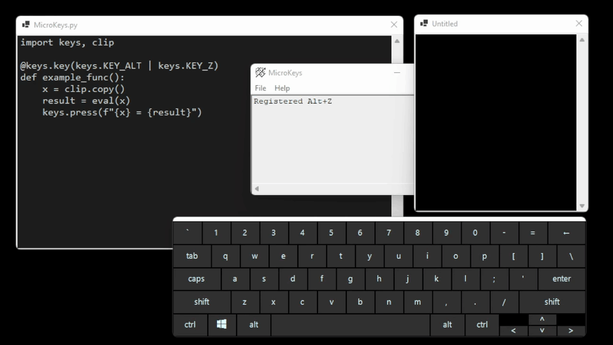

# MicroKeys

This is a *work in progress*.

This is a key macro program for Windows that runs Python functions in response to key presses, using [MicroPython](https://micropython.org/) to parse the script.  The long term goal is complete the macro language and improve the UI.  The simple example shown above shows a formula being typed into a text box, the contents being copied to the clipboard, then the macro key is hit, causing MicroKeys to evaluate the formula and type out the answer.  More than the use of this particular macro, this is meant as an example of the potential power of having MicroPython available to respond to key presses.

To run this locally, download the [latest release](https://github.com/seligman/microkeys/releases), decompress it to a local folder, and run `MicroKeys.exe`.

If you want to run this from source, you'll need Visual Studio, along with Python 3.9+ and Git in your path.  To run the POC, sync this project down, then run `get_micropython.py` to sync down MicroPython and patch it to be built as a library in a windows GUI app.  Then you can open the VS solution, and run it.

It's currently in a beta state.  There is much work necessary to get this to a final release, you can track the [status here](TODO.md).

Questions? Feedback? [E-mail me](mailto:scott.seligman@gmail.com).
