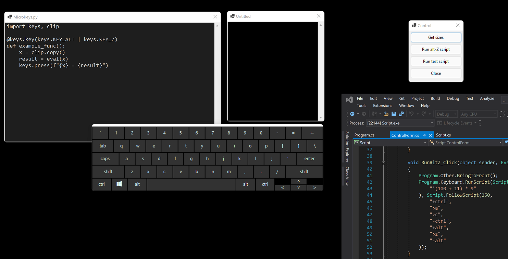

## Script

This is a C# application to present a mock UI to demo how MicroKeys runs.  It presents a couple of text box windows, a keyboard and has a simple script language to run throw pressing keys, and showing which keys are pressed on the keyboard, and showing the actions MicroKeys takes in response in a text window.

Recording of the resulting activity is done with a third party application like OBS.
